

  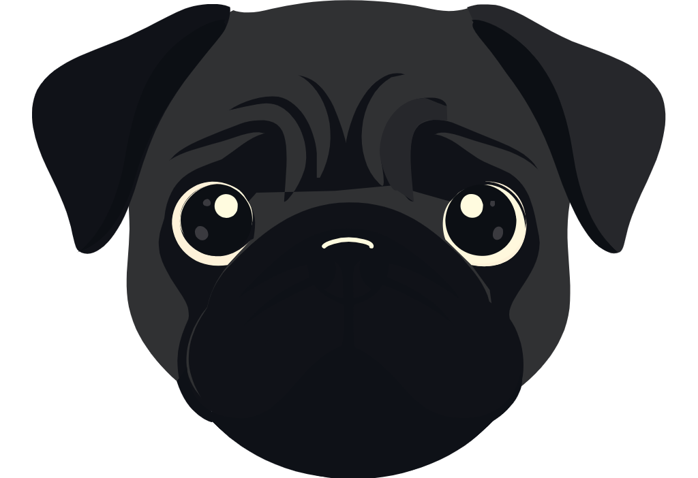

<h1 align="center">TobiaSVG</h1>

  Fine-tuning multimodal models for image-to-SVG vectorization.

  
  
  
  

  <a href="#motivation">Motivation</a> ·
  <a href="#vision-encoder-context">Vision encoders</a> ·
  <a href="#method">Method</a> ·
  <a href="#training">Training</a> ·
  <a href="#results">Results</a>

---

## Motivation

Image vectorization is more than tracing pixels. A model must recognize visual
structure, choose useful SVG primitives, preserve text and layout, and emit
valid, editable code. TobiaSVG explores whether an existing compact multimodal
model can be specialized for semantic image-to-SVG vectorization.

This project fine-tunes the existing Qwen3.5-4B multimodal model. It does not
introduce or train a new vision encoder.

## Vision Encoder Context

### CLIP

[CLIP](https://arxiv.org/abs/2103.00020) showed that natural language can be a
powerful supervision signal for learning transferable visual representations.
It trains an image encoder and a text encoder so matching image-caption pairs
are close in embedding space and unrelated pairs are far apart. At inference,
an image can be classified zero-shot by comparing it with natural-language
descriptions of candidate classes.

That semantic alignment made CLIP-style encoders a natural fit for multimodal
SVG systems. Previous image-to-SVG efforts similarly relied on pretrained
vision encoders rather than exploring a task-specific DINO backbone.

### DINO

[DINO](https://arxiv.org/abs/2104.14294) learns visual representations from
images alone. A student predicts the output of a momentum-updated teacher across
different augmented views of the same image. It avoids explicit negative pairs
and uses centering, sharpening, and multi-crop training to prevent collapse.
Its Vision Transformer features capture both global semantics and meaningful
local structure, making them an interesting candidate for vectorization.

### Scope

DINO's emergent localization and object-boundary features give it strong
spatial and geometric awareness, which makes a DINO-backed SVG generator an
especially interesting direction. I could not find an autoregressive SVG
generation framework that used DINO as its vision backbone, although DINO
features are already used through metrics such as DinoScore to compare a
generated SVG's rendering with the original image. I wanted to explore this
architecture, but replacing the existing vision stack would require a new,
potentially large projection adapter and substantially longer multimodal
training. TobiaSVG was a personal project with a limited compute budget, and
every training run used rented GPUs, so the pretrained Qwen3.5 vision stack was
kept unchanged.

This led to a second question: how would a natively multimodal model such as
Qwen3.5 perform on image-to-SVG vectorization? Qwen3.5 is pretrained with early
fusion over text and visual tokens, so its vision encoder and projector are
aligned with the language decoder at foundation-model scale. I suspected that
this would provide a stronger starting point than a LLaVA-style architecture,
where a separately pretrained vision encoder and language model are connected
by a learned projector and aligned during later multimodal training stages.
This hypothesis motivated the choice of Qwen3.5-4B for TobiaSVG, although a
controlled comparison between the two architectures was outside the scope of
the project.

## Method

The training corpus combined VFIG shapes and complex diagrams, a 40K subset of
SVGX-Core-250k, SVG Animal Illustrations, StarVector diagrams, and StarVector
SVG-Emoji. Existing animal prompts and SVGX captions were retained; the
remaining SVGs were rendered and captioned with Gemini 3.1 Flash Lite, using
more detailed descriptions for complex VFIG diagrams. The public
[TobiaSVG](https://huggingface.co/datasets/shravandoda/TobiaSVG) release omits
StarVector-derived rows and contains 106,524 text-SVG pairs, while the auxiliary
[repair dataset](https://huggingface.co/datasets/shravandoda/TobiaSVG-repair)
contains 44,802 synthetic corrupted-clean SVG pairs.

SVGs were decoded and normalized, missing closing SVG tags were repaired where
possible, and every retained sample had to parse as XML and render successfully
with CairoSVG. Diagram-focused sources were filtered to contain geometric
elements, at least 40% structural primitives, and no more than 50 complex
shapes. Clean SVG identity was hashed to produce deterministic 80/10/10 splits
without target leakage, and task-specific examples longer than 12,288 tokens
were removed before training. Repair pairs used medium or hard object, z-order,
primitive, text, style, geometry, and grouping corruptions; changes below a
render MSE of 0.002 or a changed-pixel ratio of 0.01 were rejected, and 10% of
accepted pairs received an additional truncation corruption.

## Training

Training used Hugging Face Accelerate with DistributedDataParallel (DDP) across
two rented 96 GB RTX PRO 6000 WS GPUs. DDP improved throughput, but it did not
pool their memory: each GPU still held a complete model replica and processed
its own local batch. Early runs repeatedly ran out of memory because the main
bottleneck was not the 4B model weights, but the activations created by long
multimodal sequences and retained for backpropagation. The final setup used a
micro-batch size of one per GPU, bfloat16 precision, gradient checkpointing,
disabled KV caching, and gradient accumulation to make a 12,288-token context
practical.

The model still found ways to OOM. Memory profiling exposed another culprit:
the LM head was materializing logits across the full sequence and roughly 248K
token vocabulary, producing an enormous tensor at long context lengths. **Enter
[Liger Kernel](https://github.com/linkedin/Liger-Kernel).** Its fused linear
cross-entropy computes the vocabulary projection and loss together without
retaining the full logits tensor. After that change, peak allocated VRAM stayed
below 32 GB for the rest of the run. I had considered sharding the model with
DeepSpeed ZeRO-3 or FSDP to leave more room for activations, but those methods
primarily reduce model-state memory; they would have created more headroom
without directly reducing the activation footprint itself.

The final run completed 36,000 optimizer updates. Each update accumulated one
text-to-SVG microbatch, one image-to-SVG microbatch, and one SVG-repair
microbatch on every GPU before changing the weights. With a local microbatch
size of one and two DDP workers, that meant six examples per update and 216,000
example presentations across the full run, evenly divided between the three
tasks. Training and validation losses were tracked with Weights & Biases.

  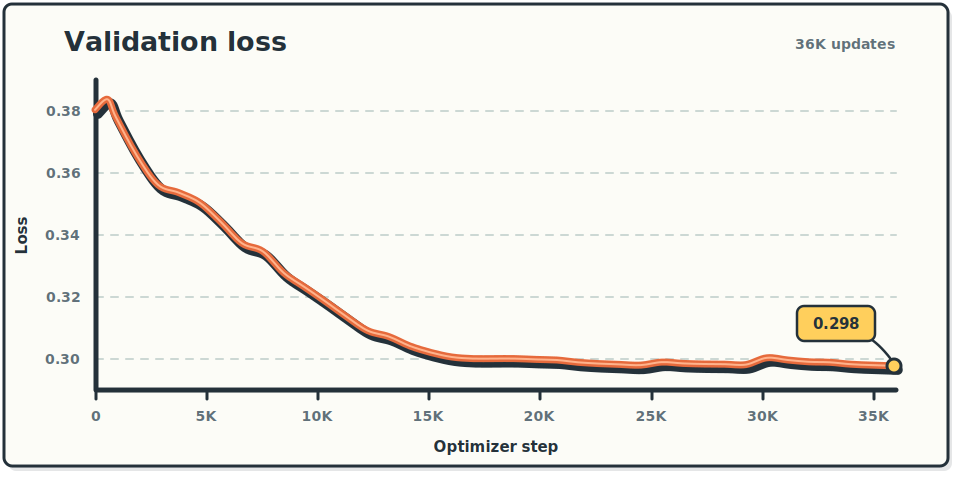

## Results

The following test examples compare the original raster input with SVGs from
the base model, TobiaSVG, Gemini 3.1 Flash, and GPT-5.3-Codex. Every output
shown here was valid and renderable.

### Status Diagram

<table align="center" border="3" bordercolor="#24313a" cellpadding="10" cellspacing="0" width="90%">
  <tr>
    <th colspan="2">Original raster</th>
  </tr>
  <tr>
    <td colspan="2" align="center">
      <a href="assets/results/status-original.png?raw=1">
        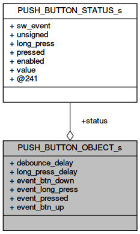
      </a>
    </td>
  </tr>
  <tr>
    <th width="50%">Base model</th>
    <th width="50%" bordercolor="#e66a3c"><strong>TobiaSVG (ours)</strong></th>
  </tr>
  <tr>
    <td align="center">
      <a href="assets/results/status-base.png?raw=1">
        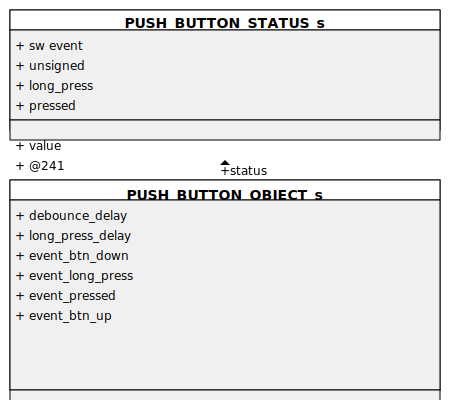
      </a>
    </td>
    <td align="center" bordercolor="#e66a3c">
      <a href="assets/results/status-tobiasvg.png?raw=1">
        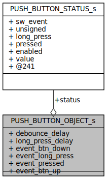
      </a>
    </td>
  </tr>
  <tr>
    <td align="center">MSE 0.2013</td>
    <td align="center" bordercolor="#e66a3c"><strong>MSE 0.0635</strong></td>
  </tr>
  <tr>
    <th>Gemini 3.1 Flash</th>
    <th>GPT-5.3-Codex</th>
  </tr>
  <tr>
    <td align="center">
      <a href="assets/results/status-gemini.png?raw=1">
        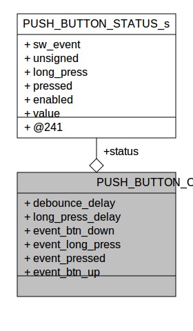
      </a>
    </td>
    <td align="center">
      <a href="assets/results/status-gpt.png?raw=1">
        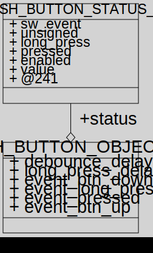
      </a>
    </td>
  </tr>
  <tr>
    <td align="center">MSE 0.3518</td>
    <td align="center">MSE 0.1207</td>
  </tr>
</table>

 

### Sequence Diagram

<table align="center" border="3" bordercolor="#24313a" cellpadding="10" cellspacing="0" width="90%">
  <tr>
    <th colspan="2">Original raster</th>
  </tr>
  <tr>
    <td colspan="2" align="center">
      <a href="assets/results/sequence-original.png?raw=1">
        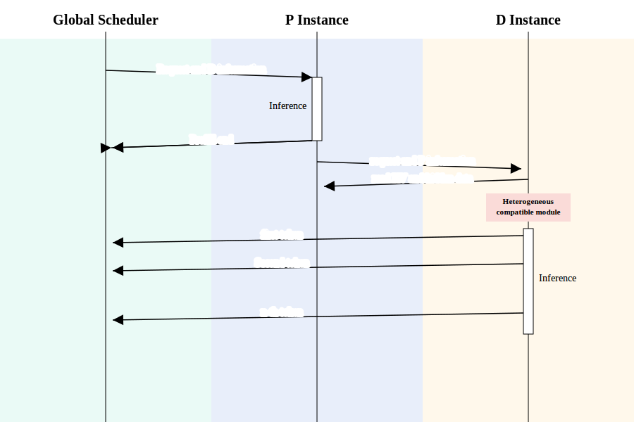
      </a>
    </td>
  </tr>
  <tr>
    <th width="50%">Base model</th>
    <th width="50%" bordercolor="#e66a3c"><strong>TobiaSVG (ours)</strong></th>
  </tr>
  <tr>
    <td align="center">
      <a href="assets/results/sequence-base.png?raw=1">
        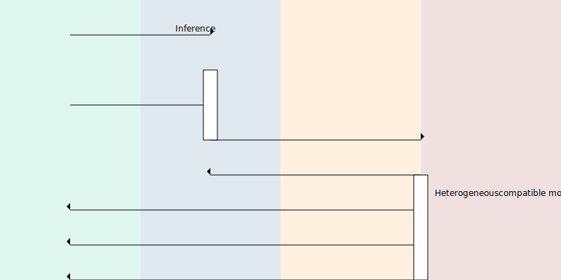
      </a>
    </td>
    <td align="center" bordercolor="#e66a3c">
      <a href="assets/results/sequence-tobiasvg.png?raw=1">
        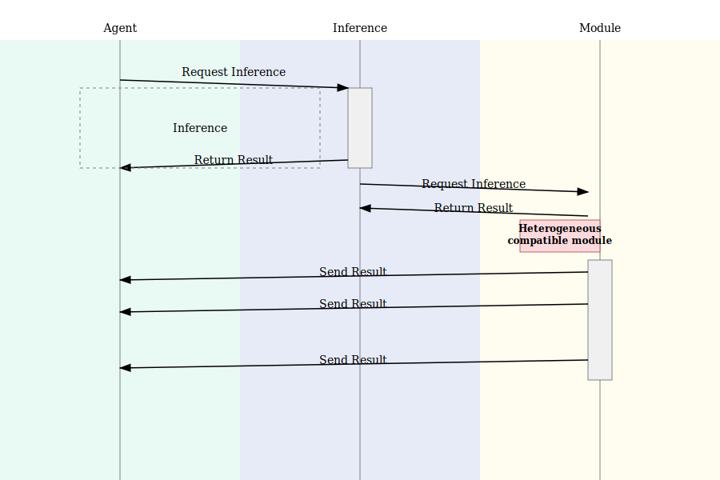
      </a>
    </td>
  </tr>
  <tr>
    <td align="center">MSE 0.0919</td>
    <td align="center" bordercolor="#e66a3c"><strong>MSE 0.0204</strong></td>
  </tr>
  <tr>
    <th>Gemini 3.1 Flash</th>
    <th>GPT-5.3-Codex</th>
  </tr>
  <tr>
    <td align="center">
      <a href="assets/results/sequence-gemini.png?raw=1">
        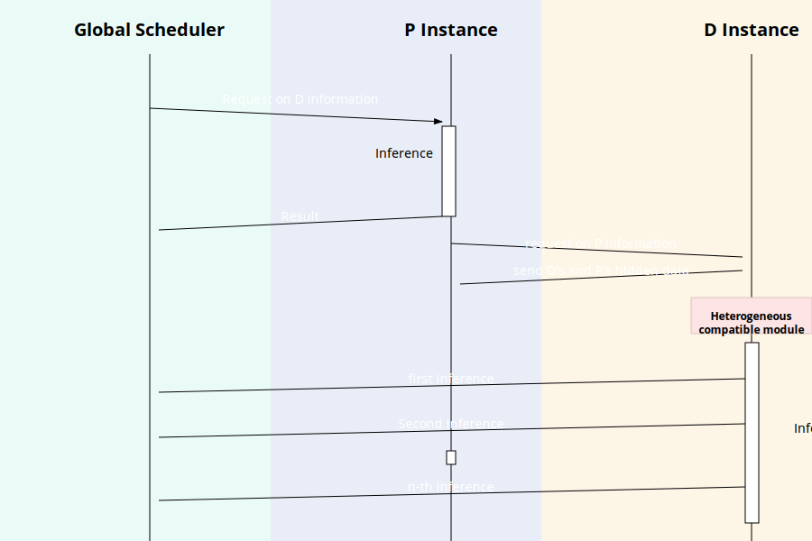
      </a>
    </td>
    <td align="center">
      <a href="assets/results/sequence-gpt.png?raw=1">
        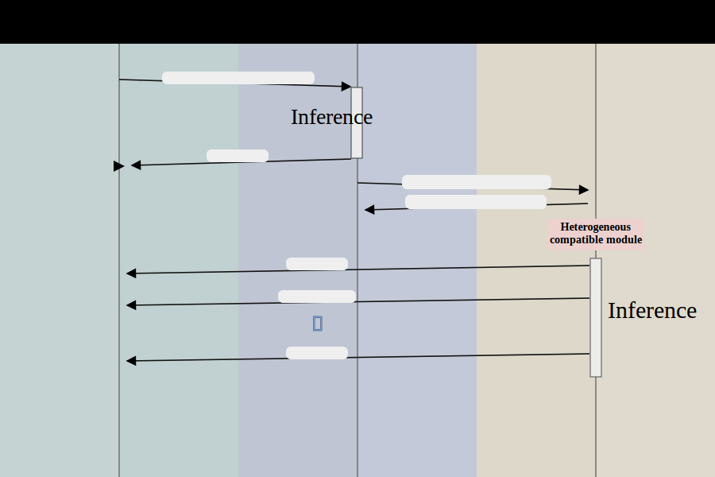
      </a>
    </td>
  </tr>
  <tr>
    <td align="center">MSE 0.0922</td>
    <td align="center">MSE 0.0393</td>
  </tr>
</table>

 

### Mean Pixel MSE

Mean pixel MSE across the 13 examples rendered successfully by both local
models. Lower is better.

| Model | Mean MSE |
| --- | ---: |
| Base model | 0.1457 |
| **TobiaSVG** | **0.0529** |
| Gemini 3.1 Flash | 0.2065 |
| GPT-5.3-Codex | 0.0930 |

## Limitations

This was a compute-constrained personal training run. More diverse training
data and a longer run could likely improve the model further, especially on
complex illustrations and long SVG sequences.

Pixel MSE is also an incomplete evaluation metric: it measures raster-level
agreement but not semantic correctness or SVG quality. A stronger evaluation
suite should include DINO Score for perceptual similarity and clean SVG ratio
for syntactic validity and renderability. Rendering-aware reinforcement
learning could also optimize directly against the rendered result while
rewarding valid structure and discouraging malformed or repetitive SVGs.
